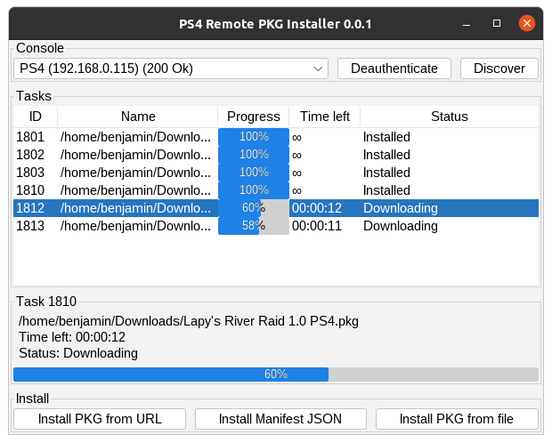

# PS4 Remote PKG Installer
PS4 Remote PKG Installer GUI for https://github.com/flatz/ps4_remote_pkg_installer

Tired of copying PKG files to USB then walking over to your PS4 and manually installing them? PS4 Remote PKG Installer is here to help!

## Usage
- Install [Java 8](https://www.oracle.com/java/technologies/javase-jre8-downloads.html) or higher
- Download [PS4 Remote PKG Installer](https://github.com/BenjaminFaal/ps4-remote-pkg-installer/releases)
- Start the .jar file

## Features
- PS4 automatic discovery
- Wake up PS4 from standby
- Start Remote PKG Installer
- Install local PKG files
- Install PKG files from URL
- Install Manifest JSON
- View tasks
- Manage tasks
  - Pause
  - Resume
  - Stop
  - Remove
    
Got any suggestions or good ideas? Don't hesitate to open an issue: [Open issue](https://github.com/BenjaminFaal/ps4-remote-pkg-installer/issues/new?labels=enhancement)